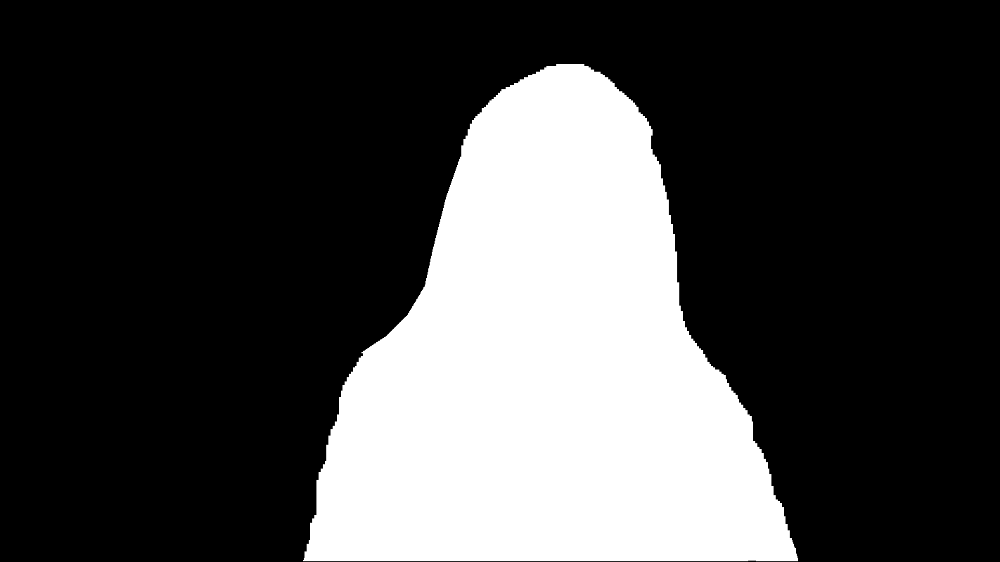
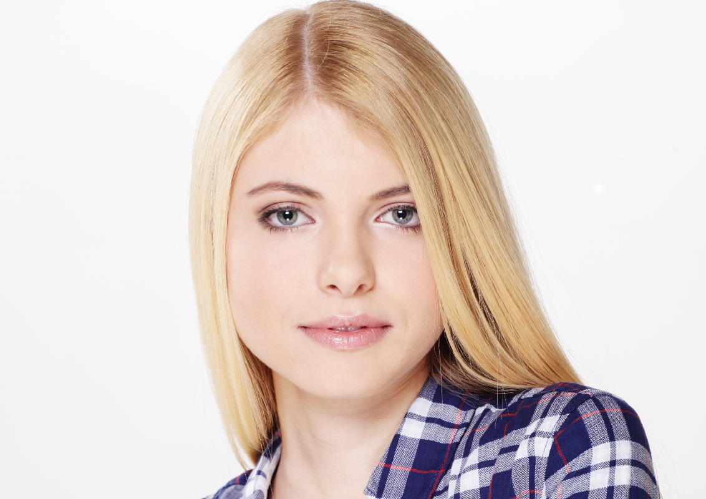
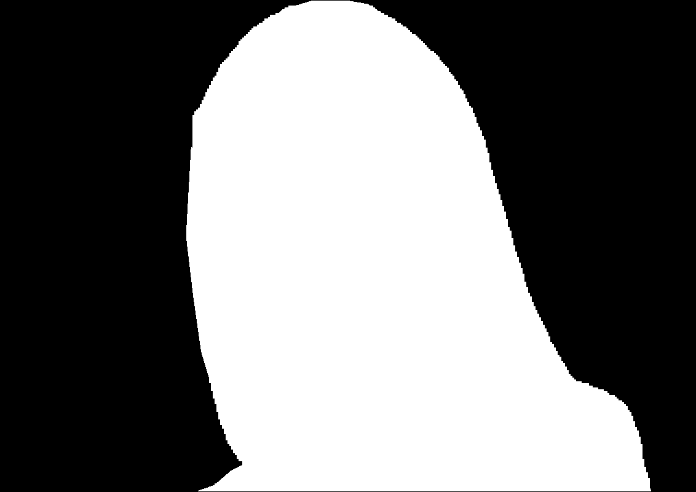
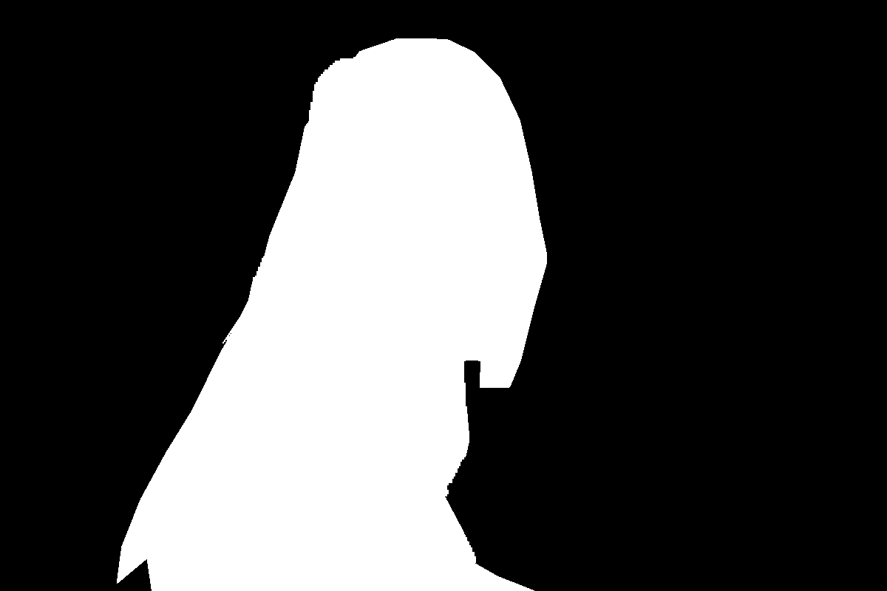
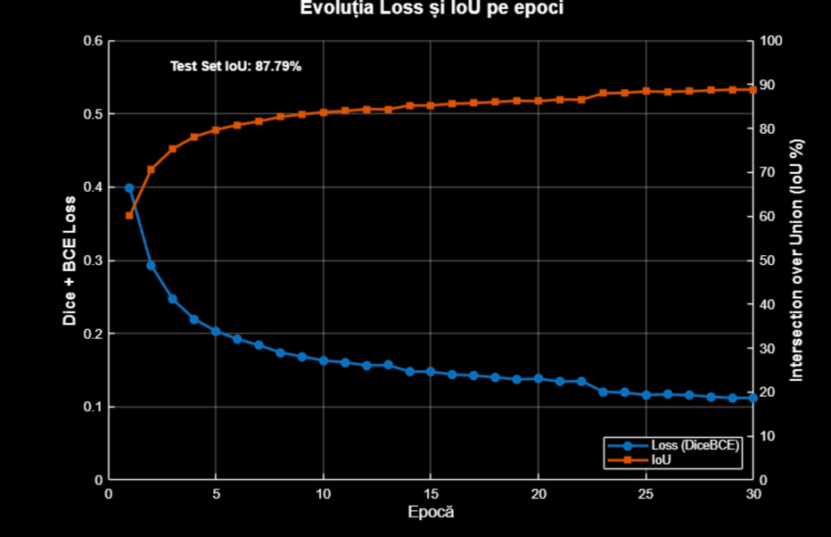
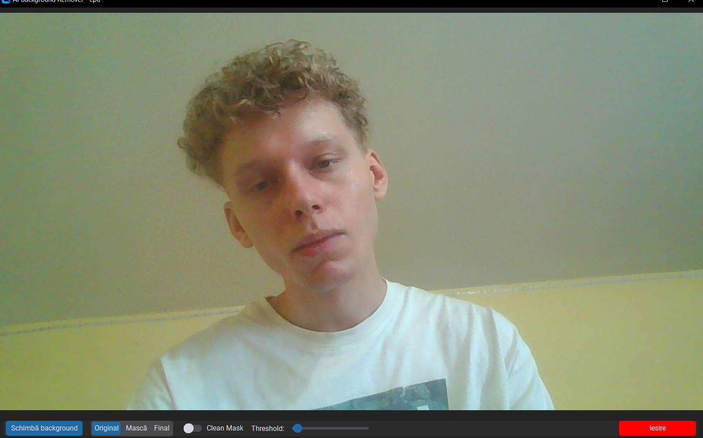
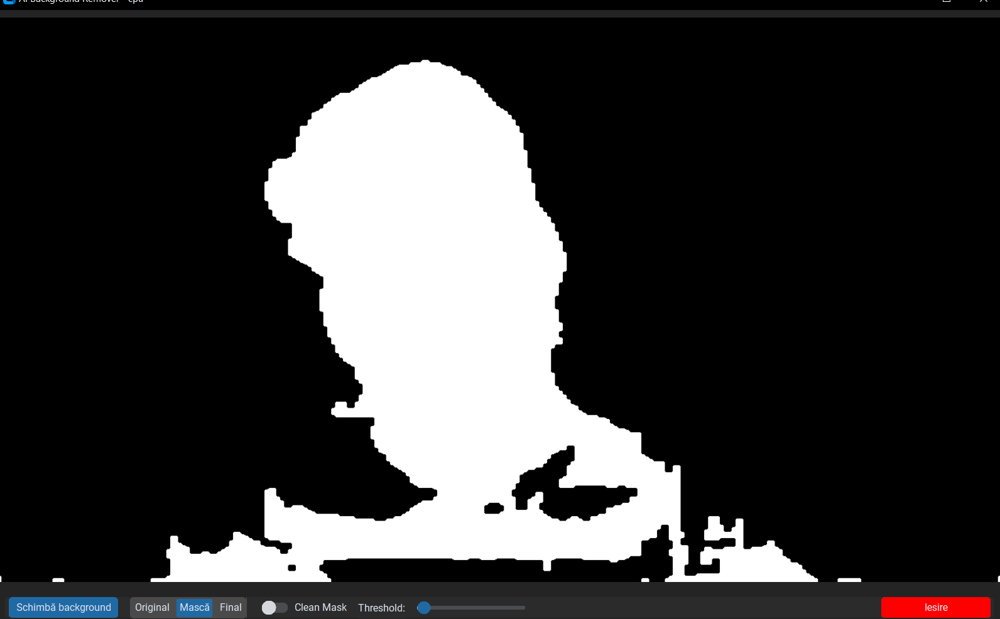
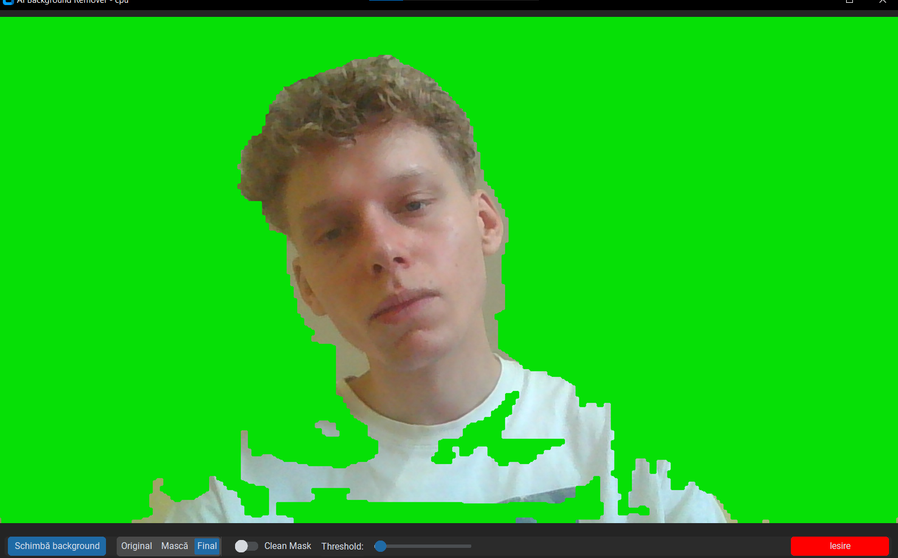
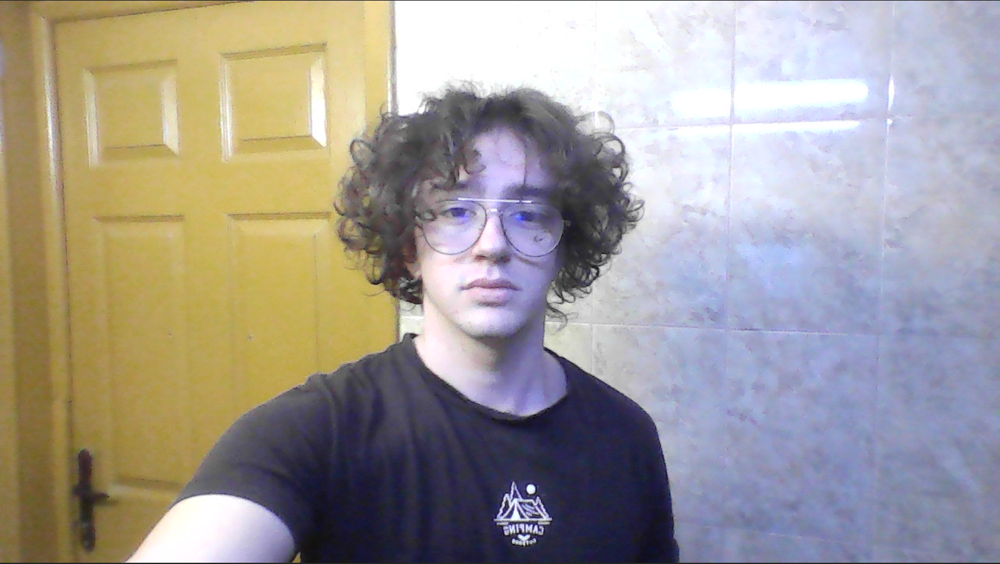
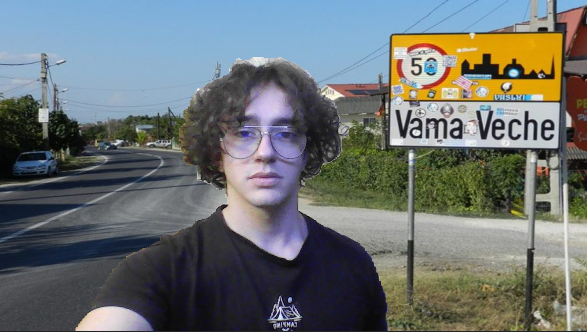

  <h1> Live Background removal</h1>
  
Un sistem automat care captează video în timp real, segmentează persoana folosind o rețea neuronală, 
  și înlocuiește fundalul la alegerea utilizatorului.

  

 &emsp;&emsp;Obiectivul proiectului a fost dezvoltarea unui sistem automat care captează video în timp real, segmentează persoana folosind o rețea neuronală și înlocuiește fundalul conform alegerii utilizatorului, oferind un rezultat fluent și realist.  
 
<h2 align="left">Proiecte Similare</h2>

| Nr. | Autor(i) / An                                          | Titlul articolului / proiectului                                      | Aplicație / Domeniu                     | Tehnologii utilizate                   | Metodologie / Abordare                                    | Rezultate                                                  | Limitări                                                  | Comentarii suplimentare                              |
|-----|-------------------------------------------------------|-----------------------------------------------------------------------|---------------------------------------|--------------------------------------|----------------------------------------------------------|------------------------------------------------------------|-----------------------------------------------------------|-------------------------------------------------------|
| 1   | Cioppa, Van Droogenbroeck, Braham (2020)              | Real-Time Semantic Background Subtraction                             | Supraveghere video                    | CNN, rețele neuronale                | Subtracție semantică combinată cu algoritmi clasici       | Performanță în timp real cu acuratețe bună                 | Sensibil la schimbări bruște ale iluminării               | Metodă eficientă pentru scene statice                   |
| 2   | Wang, Gao, Li, Lin, Cheng, Sun (2020)                                     | Removing the Background by Adding the Background                      | Reprezentare video auto-supervizată  | Deep learning                       | Învățare auto-supervizată pentru robustețe la fundal      | Model robust la variații de fundal                          | Complexitate ridicată a antrenării                         | Aplicații în analiza video neetichetată                 |
| 3   | Lin, Ryabtsev, Sengupta,Kemelmacher-Shlizerman (2020)                                     | Real-Time High-Resolution Background Matting                         | Editare video, realitate augmentată  | Rețele neuronale convoluționale     | Rețele duale pentru matting la rezoluție înaltă           | Procesare 4K la 30fps, calitate ridicată                   | Necesită GPU puternic                                    | Ideal pentru aplicații în timp real de înaltă rezoluție |
| 4   | Bahri, Ray (2023)                                     | Weakly Supervised Realtime Dynamic Background Subtraction             | Monitorizare dinamică                 | Învățare slab-supervizată            | Abordare slab-supervizată pentru fundal dinamic           | Performanță bună fără etichete la nivel de pixel           | Limitat în condiții extreme de iluminare                  | Bine adaptat pentru medii dinamice                       |
| 5   | Shahi, Li (2023)                                      | Deep Learning for Background Replacement in Video Conferencing       | Conferințe video                     | U-Net, MobileNet, ConvLSTM            | Modele multiple pentru înlocuire fundal                    | Evaluare comparativă a metodologiilor, rezultate bune       | Necesită date bine etichetate                             | Folosit în aplicații comerciale și open-source           |

 <h2 align="left">Schema bloc a proiectului și descriere module</h2>

                  -------------------
                  |  Captură video  |  ------------> Capturează în timp real stream-ul video de la cameră.      
                  -------------------                Acesta furnizează cadrele (frame-urile) necesare procesării ulterioare.
                           |
                           v
                  -------------------              Pregătește cadrele video pentru segmentare: redimensionare, 
                  |   Preprocesare  |  ------------>  normalizare, conversie în formatul necesar rețelei neuronale. 
                  -------------------
                           |
        --------------------
        |   ---------------------------------                   
        |   |  Antrenare (Rețea neuronală)  |  ----->  Antreneaza o retea Neuronala pe o baza de date.
        |   ---------------------------------
        |                 |
        |                 v
        | ---------------------------------         Aplică o rețea neuronală antrenată pentru segmentarea semantică,           
        ->|  Segmentare (Rețea neuronală) |  ----->  identificând silueta persoanei în fiecare cadru.
          ---------------------------------
                          |
                          v
                  -------------------                 Rafinează masca obținută de la rețea: elimină zgomotul, netezește marginile 
                  |  Postprocesare  |  ------------>  și aplică eventuale filtre.
                  -------------------
                           |
                           v
                  -----------------------             Înlocuiește fundalul original cu o imagine aleasă de utilizator, 
                  |  Background Replace |  ----------> păstrând doar persoana segmentată în prim-plan.
                  -----------------------
                           |
                           v
                  --------------------                Afișează în timp real cadrul modificat, cu fundalul înlocuit, 
                  | Afișare rezultat |  ------------> într-o fereastră sau interfață grafică.
                  --------------------
                           ^
                           |
              ----------------------------
              |     Control utilizator   |--------->Permite utilizatorului să schimbe fundalul sau să pornească/oprească procesul.
              ----------------------------

 <h2>Setul de date pentru antrenarea modelului</h2>
  &emsp;&emsp;Pentru antrenarea modelului au fost folosite 12.811 de imagini fiecare având propria mască binară:
  * Human Segmentation Dataset - Kaggle
    - 2.667 imagini + 2.667 măști binare
  * Dataset human - Hugging Face (Schirrmacher)
    - 10.144 imagini + 10.144 măști binare
       
  &emsp;&emsp;Pentru a obține un set de antrenare mai mare am folosit tehnici de augmentare a datelor: rotire orizontală a imaginilor și măștii corespunzătoare plus rotații geometrice cu valori între -15 și 15 grade
<h3>Exemple:</h3>

| Imagine originală | Mască binară |
|:---:|:---:|
|  |  |
|   |   |
|  |  |
|   |   |
|  |  |

 
<h2>Metode de evaluare și metrici</h2>

Performanțele soluției au fost evaluate folosind următoarele metrici și metode de evaluare:

* **Dice + BCE Loss:** reprezintă funcția de pierdere hibridă utilizată pentru a minimiza eroarea în timpul antrenării, combinând acuratețea la nivel de pixel (BCE) cu optimizarea formei obiectului segmentat (Dice).
* **Intersection over Union (IoU):** este principala metrică de precizie care măsoară gradul de suprapunere între masca prezisă de model și masca reală.

 

Performanțele soluției au fost evaluate folosind următoarele metode de evaluare:

* La finalul fiecărei epoci, modelul a fost evaluat pe un set de validare (un grup de imagini separat de cel de antrenare) pentru a măsura progresul real.
* Validarea finală a fost efectuată prin metoda Hold-out utilizând un set de test de 10% complet izolat de procesul de învățare.

 
<h3>Evoluția Loss și IoU pe epoci</h3>
 

<table><tr><td>

</td>
<td>

Pe măsură ce numărul epocilor crește, loss-ul scade constant, semn că modelul învață să facă predicții tot mai precise. În același timp, IoU crește progresiv, indicând o îmbunătățire clară a calității segmentării realizate de model.

</td></tr></table> 

<h2>Rezultate</h2>
 

| Imagine originală | Mască binară | Final |
|:---:|:---:|:---:|
|  |  |  |
|   |   |   |
|  |  |  |

